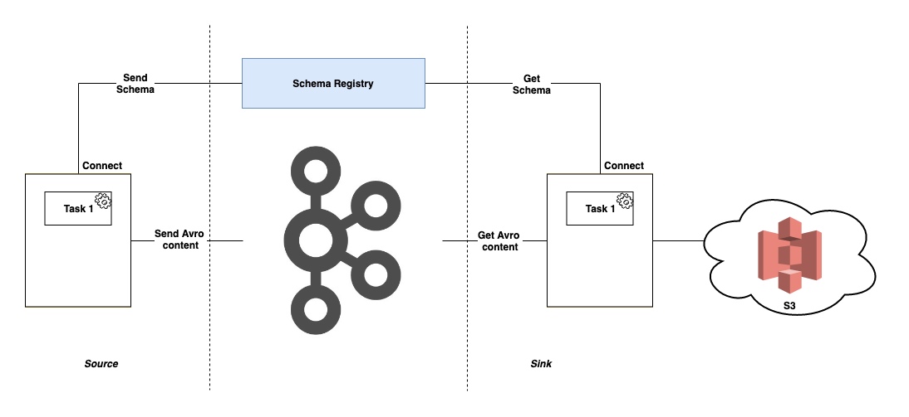

# Kafka Connect S3 Sink Demo

## What is Kafka Connect?

> Kafka Connect, an open source component of Apache Kafka®, is a framework for connecting Kafka with 
external systems such as databases, key-value stores, search indexes, and file systems


## Prerequisite tools for this demo
 
  - Kafka (with Zookeeper)
  - Schema Registry
  - Kafka Connect (source and sink connectors)
  - AWS CLI / console
  
 Check this [instructions page](./INSTALL.md) for installing of Kafka, Schema Registry and Kafka Connect.


## Architecture




## Manage Kafka Connect connectors


  - ### Kafka Connect Source - random datagen
      ```bash
        confluent config datagen-users -d datagen-users.json
      ```
      **_datagen-users.json_** file can be available [here](./resources/datagen-users.json) 
  

  - ### Kafka Connect Sink - S3 
      ```bash
        confluent load s3-sink -d kafka-connect-s3/quickstart-s3.properties
      ```
      **_kafka-connect-s3/quickstart-s3.properties_** file can be available [here](./resources/connect-s3-sink.properties)

  - ### Pause/Resume random datagen connector
      ```bash
        curl -X PUT http://localhost:8083/connectors/datagen-users/{pause/resume}
      ```
      
  - ### Pause/Resume s3 sink connector
      ```bash
        curl -X PUT http://localhost:8083/connectors/s3-sink/{pause/resume}
      ```
      
  - ### Check connect status
      ```bash
        curl ocalhost:8083/connectors/{datagen-users/s3-sink}/status
      ```
      
  - ### Delete s3 sink/random datagen connector
      ```bash
        curl -X DELETE http://localhost:8083/connectors/{datagen-users/s3-sink}
      ```
      
## Verify the content in S3 with AWS CLI

> Make sure the CLI has been configured with `aws_access_key_id` and `aws_secret_access_key`

Check the files exists or not

```bash
  aws s3 ls s3://connect-demo-sri/topics/ #--recursive
``` 

Copy any file to local to verify with _**avro-tools**_

```bash
  aws s3 cp s3://connect-demo-sri/topics/path/to/some/filename.avro some/local/path/
  java -jar avro-tools.jar tojson some/local/path/filename.avro
```

**_avro-tools.jar_** can be downloaded from [here](http://www.us.apache.org/dist/avro/stable/java/avro-tools-1.8.2.jar)


      
  
